# Keycloak

This section contains information about setting up [keycloak](https://www.keycloak.org/) as the OpenID provider for the platform.

Sections:

1. [Installation](#installation).
2. [Permanent Administrator](#setting-up-permanent-administrator) - How to setup permanent administrator.
3. [Setup Realm For OpenID](#setup-realm-for-openid) - Create a realm for openid.
4. [API Documentation](./api/README.md).

## Setup realm for openid

1. Click the current realm at the top left of the screen then click `create realm`.
   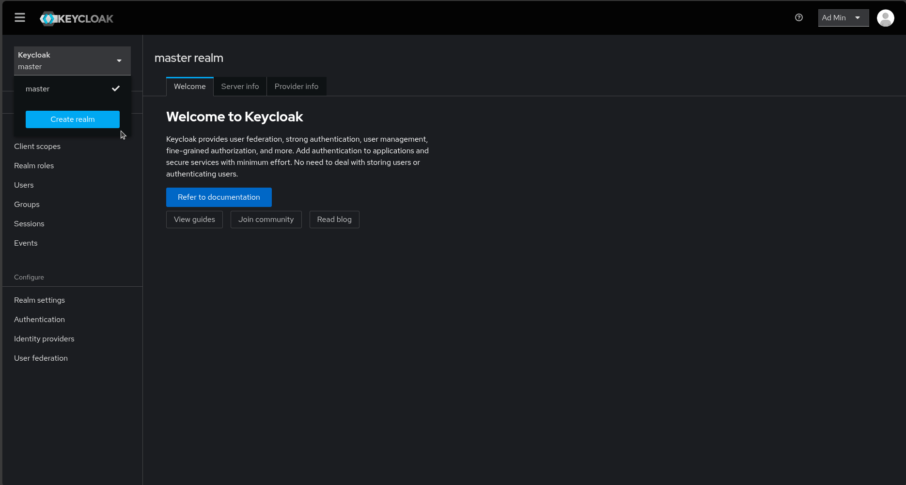

2. Enter realm name (preferably short name with no spaces) the click `create`.
   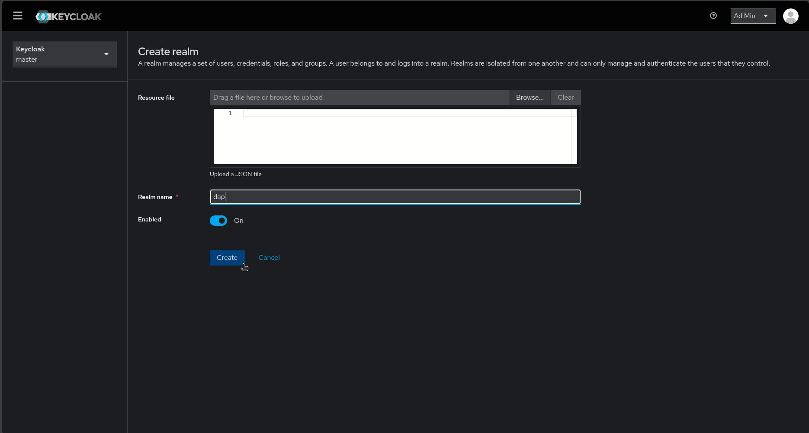

3. Head to the `Clients` section and click `Create client`.
   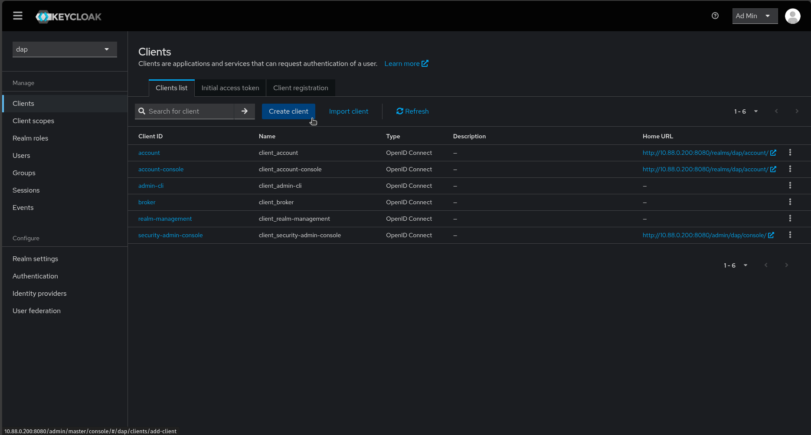

4. Enter required information then click `Next`.
   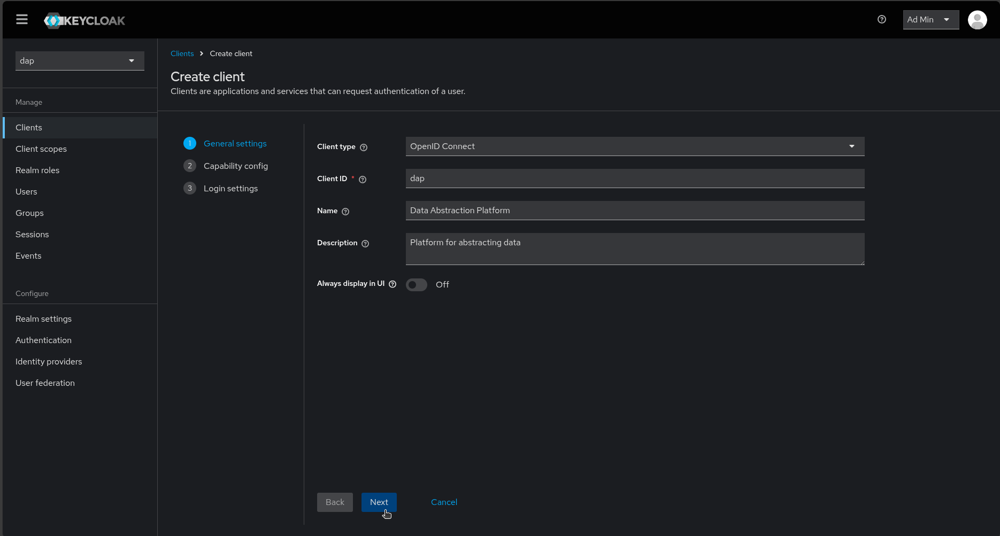

5. Ensure `Client Authentication` is `On` as well as `Standard flow` and `Direct access grants` are enabled. Then click `Next`.
   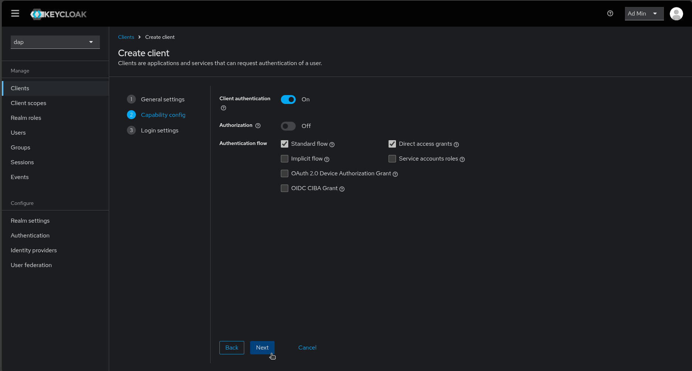

6. Enter required information then click `Save`. Ensure `Root URL` and `Home URL` match the frontend website url and the `Valid redirect URI` includes the backend api url.
   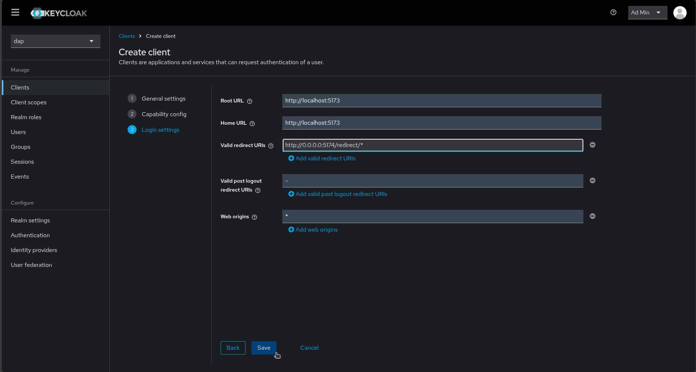

7. The OpenID secret can be found in the `Client Secret` under the `Credentials` tab.
   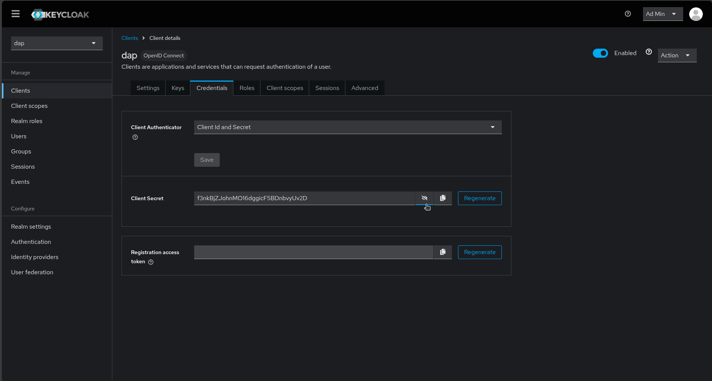

8. Enable the ability to revoke Refresh Tokens by heading to the `Realm settings` section and navigating to the `Tokens` tab. Enable `Revoke Refresh Token` and set max reuse to `1`. You can also adjust other token features within the same tab, and `Sessions` tab as well, like setting their lifespan.
   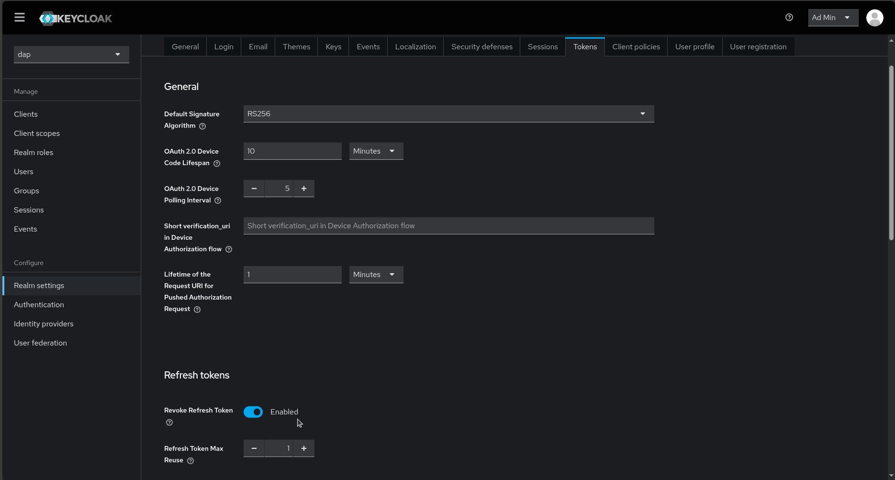

9. Enable `User registration` link and other features under the `Login` tab.

10. Created users can be managed under the `Users` section.

## Setting up permanent administrator

If you log into the keycloak platform using the bootstrap credentials that were assigned when running the container, the platform will prompt you to create a permanent administrator.

Using the instructions found [here](https://github.com/keycloak/keycloak/discussions/33803) we can be able to create a permanent administrator.

1. Log into the platform using the bootstrap credentials.

2. Navigate to the `Users` section.
   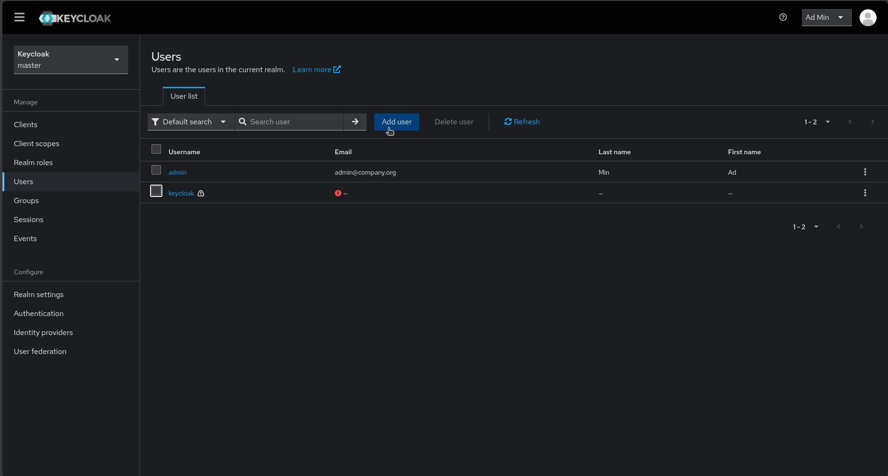

3. Click `Add User` and enter new user information like below then Click `Create`. Ensure `Email verified` is on.
   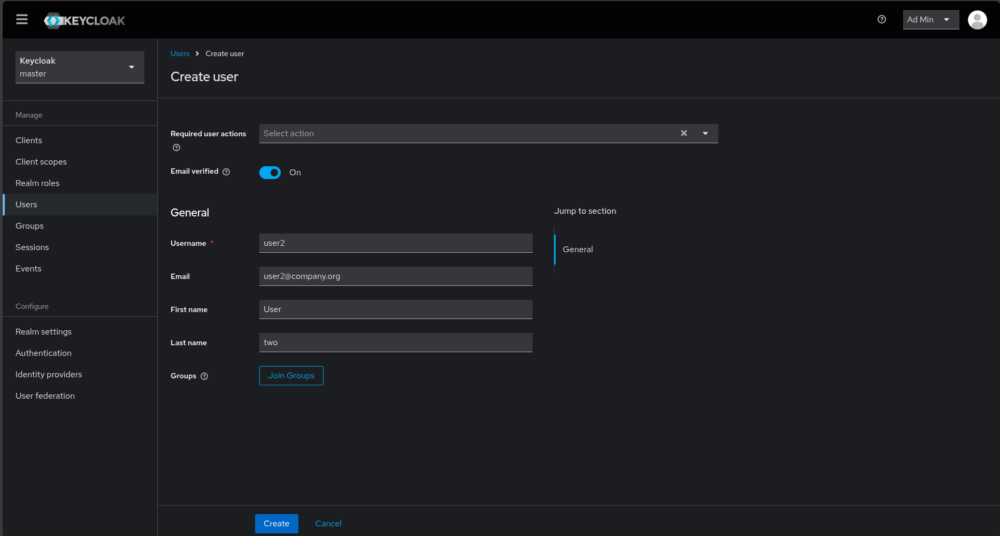

4. Set new users password by clicking on the created user in the `Users` then click `Credentials` tab then `Set password`. Ensure the switch off `Temporary`.
   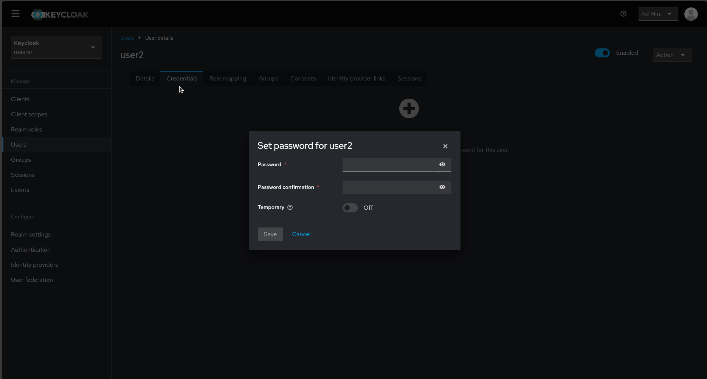

## Installation

### Pre-requisites

1. Postgres up and running with a database that can be used by keycloak already setup. Database can be called `keycloak`.
2. Container engine available e.g.
   - [Docker](../docker.md).
   - [Podman](../podman.md).

### 1. Prepare Dockerfile

The template `Dockerfile` can be found [here](../../../build/Dockerfile.keycloak.template).

Edit it and replace placeholder values (values enclosed in `<` `>`) appropriately.

Values to replace as follows:

- `<POSTGRES_HOST>` - Example: `localhost`.
- `<POSTGRES_PORT>` - Example: `5432`.
- `<KEYCLOAK_DATABASE>` - Example: `keycloak`.
- `<POSTGRES_USER>` - Example: `keycloak`.
- `<POSTGRES_PASSWORD>` - Example: `keycloak2024`.

**NB**. Ensure these values will be used to reach the correct postgres database otherwise the container will fail to run.

Example `Dockerfile` below.

```Dockerfile
FROM quay.io/keycloak/keycloak:26.0 AS builder

# Enable health and metrics support
ENV KC_HEALTH_ENABLED=true
ENV KC_METRICS_ENABLED=true

# Configure a database vendor
ENV KC_DB=postgres

WORKDIR /opt/keycloak
# for demonstration purposes only, please make sure to use proper certificates in production instead
# RUN keytool -genkeypair -storepass password -storetype PKCS12 -keyalg RSA -keysize 2048 -dname "CN=server" -alias server -ext "SAN:c=DNS:localhost,IP:127.0.0.1,IP:192.168.70.69" -keystore conf/server.keystore
RUN /opt/keycloak/bin/kc.sh build

FROM quay.io/keycloak/keycloak:26.0
COPY --from=builder /opt/keycloak/ /opt/keycloak/

# change these values to point to a running postgres instance
ENV KC_DB=postgres
ENV KC_DB_URL=jdbc:postgresql://10.88.0.100:5432/keycloak?sslmode=disable
ENV KC_DB_USERNAME=postgres
ENV KC_DB_PASSWORD=postgres2024
ENV KC_HOSTNAME=10.88.0.100
ENTRYPOINT ["/opt/keycloak/bin/kc.sh"]
```

Resulting Dockerfile should be stored in [`build`](../../build/) folder as `Dockerfile.keycloak`.

### 2. Build Keycloak container image

Script to build the container image can be found [here](../../../scripts/build/keycloak_container_image.sh).

```sh
#!/bin/bash

# Replace with appropriate values
CONTAINER_IMAGE_TAG=latest # Defaults to latest
CONTAINER_CLI="sudo podman" # Defaults to `docker`. OMIT IF DOCKER IS BEING USED.

bash scripts/build/keycloak_container_image.sh -t $CONTAINER_IMAGE_TAG -c $CONTAINER_CLI
```

### 3. Run the container

Once the image is built. Run the container using the respective container engine.

Below are the environment variables that can be used to run the container.

- `KC_HTTP_PORT` - Http port. Important. Example: `8080`.
- `KC_HTTP_MANAGEMENT_PORT` - Example: `9000`.
- `KC_BOOTSTRAP_ADMIN_USERNAME` - Temporary super admin user. Example: `keycloak`.
- `KC_BOOTSTRAP_ADMIN_PASSWORD` - Temporary super admin password. Example: `keycloak`.
- `KC_PROXY` - Set to `edge`. Enables `http` access.

Start command is **required** to run the container. Example: `start --optimized --hostname=http://localhost:8080`.

Example unoptimized start command that allows us to host keycloak on a shared domain accessible at path `http://10.88.0.200:8080/keycloak`: `start --hostname http://10.88.0.200:8080/keycloak --hostname-debug true --http-enabled true --proxy-headers xforwarded --http-relative-path /keycloak`.

Example command to run container using `podman`. Requires `root` privileges and container must have been built using `root` privileges. This enables the keycloak website to be accessible on `http://10.88.0.200:8080`.

```sh
#!/bin/bash

# Edit to match required values
KC_BOOTSTRAP_ADMIN_USERNAME=keycloak
KC_BOOTSTRAP_ADMIN_PASSWORD=keycloak
KC_HTTP_PORT=8080
KC_HTTP_MANAGEMENT_PORT=9000
CONTAINER_IP=10.88.0.200
CONTAINER_IMAGE=localhost/data_abstraction_platform/keycloak:26.0
CPU=2
MEMORY=4gb

podman run -d \
    -e KC_BOOTSTRAP_ADMIN_USERNAME=$KC_BOOTSTRAP_ADMIN_USERNAME -e KC_BOOTSTRAP_ADMIN_PASSWORD=$KC_BOOTSTRAP_ADMIN_PASSWORD \
    -e KC_HTTP_PORT=$KC_HTTP_PORT -e KC_HTTP_MANAGEMENT_PORT=$KC_HTTP_MANAGEMENT_PORT -e KC_PROXY="edge" \
    -p $KC_HTTP_PORT:$KC_HTTP_PORT -p $KC_HTTP_MANAGEMENT_PORT:$KC_HTTP_MANAGEMENT_PORT \
    --ip $CONTAINER_IP \
    --name keycloak26.0 \
    --cpus $CPU \
    --memory $MEMORY \
    $CONTAINER_IMAGE \
    start --optimized --hostname http://10.88.0.200:8080
```
